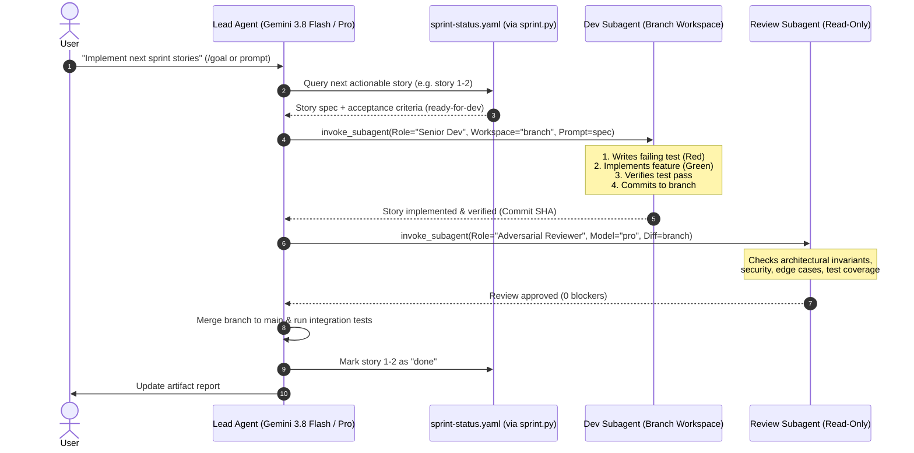
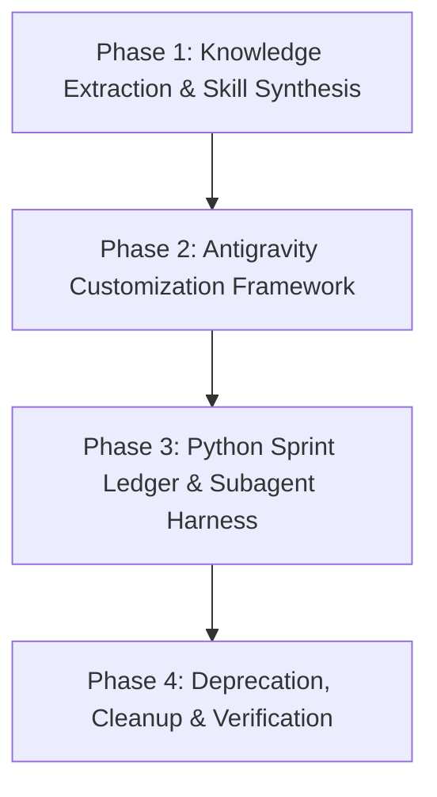

# Lean Gemini-Ready Architecture Plan: Modernizing myLoop for Antigravity

> **Goal:** Deconstruct the legacy, Claude-centric `myLoop` repository (~31,000 LOC Rust orchestrator + 46 fragmented skills), harvest its high-value software engineering methodologies and agent personas, and architect a lean, 100% native Google Antigravity & Gemini framework.

---

## 1. Executive Summary & Root Cause Analysis

### 1.1 Why the Current Architecture is Overly Complicated
The current repository is an adaptation of BMAD (and prior agent loop engines) wrapped in a Rust binary (`engine-rust`):
1. **Accidental Complexity in Orchestration (31,187 lines of Rust):**
   - The Rust engine (`pty.rs`, `signals.rs`, `hook.rs`) was built to solve Claude Code CLI terminal limitations by spawning PTY pseudo-terminals, intercepting Stop events via filesystem JSON polling (`events/*.json`), and force-killing CLI child processes.
   - In Google Antigravity (AGY), the agent **is already an autonomous orchestrator** equipped with direct tool calling (`run_command`, `write_to_file`), background task execution, and reactive messaging. Emulating a terminal PTY runner is redundant and fragile.
2. **Micro-File Token Anxiety & Snapshot Rendering:**
   - Skills are broken down into chains of micro-files (`step-01-clarify`, `step-02-plan`, `step-03-implement`, etc.) with strict rules: *"NEVER load multiple step files simultaneously"*.
   - Each skill invocation runs `myloop render-skill` or `myloop config resolve-customization`, doing template substitution across 3 tiers of TOML config files. If the binary is missing or uncompiled, the entire workflow halts.
   - This was designed for legacy models with 8k–16k context limits. Gemini 3.8 Flash and Gemini 3.1 Pro feature 1M+ token context windows; this micro-stepping creates latency, brittle file hops, and lost context.
3. **Severe Skill Bloat and Fragmentation:**
   - Out of **46 skills**, **15 are deprecated forwarding stubs** (`create-prd`, `dev-story`, `quick-dev`, `market-research`, etc.).
   - Multiple skills are microscopic single-step fragments (`editorial-review-prose`, `editorial-review-structure`, `review-verification-gap`, `checkpoint-preview`).
4. **Friction-Heavy Human Interaction:**
   - Workflows force the agent to print ASCII menu tables (`[BD]`, `[QA]`, `[CR]`) and demand user keypresses (`[C] Continue, [R] Revise`).
   - AGY supports native interactive UI components (`ask_question`), markdown artifacts with carousels and Mermaid diagrams, and slash commands (`/plan`, `/goal`, `/grill-me`).

---

## 2. Inventory & Triage: Harvesting What is Genuinely Useful

The value of `myLoop` lies in its **software engineering rigor**, **persona specialization**, and **lifecycle discipline**. We strip away the execution plumbing and preserve the intellectual methodology.

### 2.1 The 5 Essential Agent Personas (Keep & Elevate)
| Persona | Current Skill | Core Value to Retain | Antigravity Mapping |
|---|---|---|---|
| **System Architect** | `agent-architect` | System invariants, architecture trade-offs, ADRs, component boundaries | Native Subagent (`model: "pro"`, read/write, workspace: `inherit`) |
| **Senior Developer** | `agent-dev` | Strict TDD (Red-Green-Refactor), atomic commits, zero AI slop in comments | Native Subagent (`model: "flash"`, read/write, workspace: `branch`) |
| **Product Manager** | `agent-pm` | PRD authoring, user journeys, Jobs-to-be-Done (JTBD), functional scope | Interactive Skill + Subagent (`model: "flash"`) |
| **Business Analyst** | `agent-analyst` | Domain exploration, requirements grounding, evidence citation | Native Subagent (`model: "flash"`, read-only tools) |
| **UX Designer** | `agent-ux-designer` | Interaction specs, design tokens, responsive layouts, accessibility | Native Subagent / Skill |

### 2.2 Core Lifecycle Workflows (Consolidate & Streamline)
We collapse the 46 fragmented skills into **8 cohesive, high-signal workflows**:

```
[ Discovery & Research ]  -->  [ PRD & Architecture ]  -->  [ Epic/Story Decomposition ]
       (deep-recon)                  (prd / arch)                    (decompose)
                                                                          |
                                                                          v
[ Epic Retrospective ]    <--  [ Adversarial Review ]  <--  [ TDD Implementation ]
     (retrospective)                 (code-review)                     (build)
```

1. **`deep-recon` (Discovery & Research):**
   - Merges `deep-recon`, `technical-research`, `domain-research`, `market-research`.
   - Generates grounded decision briefs using web search and codebase exploration.
2. **`prd` (Product Requirements Document):**
   - Merges `prd`, `product-brief`, `prfaq`, `create-prd`, `edit-prd`, `validate-prd`.
   - Focuses on JTBD, user stories, and testable acceptance criteria (Given/When/Then).
3. **`architecture` (Technical Architecture & Invariants):**
   - Merges `architecture`, `create-architecture`, `spec`.
   - Defines system boundaries, tech stack ADRs, data models, and non-negotiable invariants.
4. **`decompose` (Epics & Stories Breakdown):**
   - Merges `create-epics-and-stories`, `sprint-planning`.
   - Decomposes architecture + PRD into bite-sized, sequential stories with explicit Input/Output matrices and initializes `sprint-status.yaml`.
5. **`build` (TDD Implementation Engine):**
   - Merges `build`, `build-auto`, `dev-story`, `quick-dev`.
   - Executes stories with strict Test-Driven Development: write failing test -> verify failure -> implement -> verify pass -> atomic git commit.
6. **`code-review` (Multi-Lens Adversarial Review):**
   - Merges `code-review`, `review`, `editorial-review*`, `review-verification-gap`, `checkpoint-preview`.
   - Evaluates diffs across 4 lenses: architectural integrity, logic/edge cases, test completeness, and security.
7. **`e2e-tests` (Verification & Regression):**
   - Retains `qa-generate-e2e-tests`.
   - Produces automated integration and end-to-end tests against real acceptance criteria.
8. **`retrospective` (Learning & Continuous Improvement):**
   - Merges `retrospective`, `correct-course`.
   - Analyzes git evidence, measures velocity vs verification gaps, updates project invariants in `GEMINI.md`.

### 2.3 What to Discard
- ❌ **The 15 Deprecated Aliases**: Immediate deletion.
- ❌ **`engine-rust` (31k lines)**: Discard PTY session handling, ConPTY, Stop event file polling, and binary debranding.
- ❌ **TOML Customization Hierarchy (`customize.toml`)**: Replaced by standard Antigravity rules (`GEMINI.md`, `AGENTS.md`, `.agents/rules/`).
- ❌ **Step Snapshot Engine (`render-skill`)**: Replaced by native prompt Markdown with progressive disclosure.
- ❌ **ASCII Menu Loops**: Replaced by native `ask_question` and Antigravity slash commands (`/plan`, `/goal`).

---

## 3. The Next Lean Repository Architecture (100% Gemini & Antigravity Native)

### 3.1 Proposed Directory Tree
```
curious-hopper/
├── .agents/                        # Antigravity native project directory
│   ├── rules/                      # Contextual & domain rules (Progressive disclosure)
│   │   ├── tdd-discipline.md       # Kent Beck TDD, no AI commentary slop
│   │   ├── architecture-rules.md   # Architectural invariants & boundaries
│   │   └── security-hygiene.md     # Code safety & credential standards
│   └── skills/                     # The 8 consolidated, high-signal skills
│       ├── deep-recon/             # Research & intelligence gathering
│       ├── prd/                    # Product requirements & JTBD
│       ├── architecture/           # Technical design & invariants
│       ├── decompose/              # Epic & story decomposition
│       ├── build/                  # TDD execution engine
│       ├── code-review/            # Adversarial multi-lens review
│       ├── e2e-tests/              # Automated integration tests
│       └── retrospective/          # Epic learning & invariant refinement
│
├── docs/                           # Living project documentation & artifacts
│   ├── prd/                        # Active and completed PRDs
│   ├── architecture/               # System invariants, ADRs, schema
│   └── stories/                    # Story specification files
│
├── scripts/                        # Lightweight, zero-compile developer tooling
│   └── sprint.py                   # ~200 LOC Python ledger CLI (reads/updates sprint-status.yaml)
│
├── sprint-status.yaml              # Clean, human- and machine-readable sprint tracker
├── AGENTS.md                       # Antigravity project conventions & persona triggers
├── GEMINI.md                       # Gemini model instructions, coding style, and tool behavior
└── README.md                       # Lean, clear documentation
```

### 3.2 Replacing the 31k-LOC Rust Engine with Native Antigravity Primitives

| Legacy Rust Engine Feature | How It Was Done in Rust | Lean Antigravity / Gemini Replacement |
|---|---|---|
| **Session Spawning & Execution** | `pty.rs` (ConPTY / POSIX PTY spawning `claude`) | `invoke_subagent` (native background agent execution with `branch` or `share` workspace) |
| **Stop Event Interception** | `signals.rs` (polling disk for `events/*.json`) | Antigravity **Reactive Wakeup** (system resumes parent agent automatically on subagent message or task completion) |
| **Multi-Story Autonomous Loop** | `run.rs` (2,500 LOC loop, retry backoff, PTY kill) | Antigravity Slash Command `/goal` or iterative subagent dispatch from parent |
| **Model & Effort Tiering** | `adapter.rs` (`default_tier_models`, argv formatting) | `invoke_subagent(Model="flash" | "pro")` + Antigravity model selection |
| **Sprint State Management** | `sprintstatus.rs` (1,200 LOC YAML parser & updater) | `scripts/sprint.py` (lightweight Python 3 standard library script) |
| **Git Verification Gate** | `verify.rs`, `git.rs` (measuring diffs, testing commit HEAD) | Direct tool execution: `run_command` (`git status`, `git diff`, test suite) |
| **Interactive Clarifications** | Printing ASCII menus, waiting on stdin | `ask_question` (interactive UI modal with checkboxes and multi-choice) |
| **Review & Artifact Output** | Shelling markdown to stdout or PTY | Antigravity **Artifacts** (`<appDataDir>/brain/<id>`) with Mermaid diagrams & alerts |

---

## 4. Execution Workflow in the Lean Architecture

### 4.1 Subagent Orchestration Model
In Antigravity, the parent agent acts as the Tech Lead / Orchestrator, dynamically spinning up subagents:



### 4.2 Sprint Ledger Specification (`sprint-status.yaml`)
A clean YAML structure maintained directly by `scripts/sprint.py`:
```yaml
project: "Curious Hopper"
tracking_system: "file-system"
story_location: "docs/stories"

development_status:
  epic-1: in-progress
  1-1-data-model: done
  1-2-core-engine: ready-for-dev
  1-3-api-endpoints: backlog
  epic-1-retrospective: optional

execution_tiers:
  1-1-data-model: flash
  1-2-core-engine: pro
  1-3-api-endpoints: flash

action_items: []
```

`scripts/sprint.py` provides simple subcommands:
- `python3 scripts/sprint.py next`: Returns the next unblocked `ready-for-dev` story key and tier.
- `python3 scripts/sprint.py update 1-2 --status in-progress`: Updates status atomically with YAML comment preservation.
- `python3 scripts/sprint.py status`: Prints a clean visual status board.

---

## 5. Migration & Implementation Roadmap



### Phase 1: Knowledge Extraction & Skill Synthesis
- Extract core prompt logic, acceptance criteria rules, and review heuristics from `skills/` into the consolidated 8 skills.
- Remove all `render-skill`, `customize.toml`, and `.claude/` references from markdown files.
- Modernize prompts to leverage Gemini's 1M+ token window: replace rigid 5-step chains with unified, coherent runbooks.

### Phase 2: Antigravity Customization Framework
- Populate `.agents/rules/`:
  - `tdd-discipline.md`: Enforce Red-Green-Refactor, no inline story metadata comments.
  - `architecture-invariants.md`: Project-specific engineering principles.
- Configure `AGENTS.md` and `GEMINI.md` at repository root for automatic progressive discovery.
- Set up the 8 skills under `.agents/skills/`.

### Phase 3: Python Sprint Ledger & Subagent Harness
- Implement `scripts/sprint.py` (zero external dependencies, standard library `urllib`/`json` or basic `yaml`).
- Write automated test for `sprint.py` checking status transitions and YAML integrity.
- Advance sprint ledger and verify git cleanliness.

---

## 6. Multi-Model & Open Harness Portability (DeepSeek, Qwen & Open Standards)

A primary flaw of the legacy `myLoop` was hard-coupling to Claude Code's internal CLI architecture. The lean architecture is intentionally designed **model-agnostic and harness-portable**.

### 6.1 Why This Architecture Works Universally with DeepSeek and Qwen
1. **Open Standard Customizations (`AGENTS.md` & `SKILL.md`):**
   - The agent definition standard (`AGENTS.md`), hierarchical markdown rules (`.agents/rules/`), and skill structure (`skills/<name>/SKILL.md` with YAML frontmatter) are open formats understood by modern LLMs and coding agents.
   - DeepSeek (V3/R1) and Qwen (2.5 Coder) naturally parse Markdown instructions, Given/When/Then acceptance criteria, and system invariants without proprietary parsing logic.
2. **Zero-Dependency Ledger (`scripts/sprint.py` + `sprint-status.yaml`):**
   - Built with pure Python 3 and standard YAML.
   - Any model or coding agent—whether running in Antigravity, OpenHands, Aider, Cline, or a custom script—can inspect the sprint status with `python3 scripts/sprint.py next` and update it with `python3 scripts/sprint.py update <key> --status done`.
3. **Elimination of Proprietary PTY/Hook Runners:**
   - Removing the 31,000-line Rust engine eliminates the brittle PTY terminal hacks and `.claude/settings.json` hook relays.
   - Any agent capable of executing shell commands and reading files can run this entire workflow.

### 6.2 Mapping Personas to DeepSeek & Qwen
The methodology's execution tiers map directly to DeepSeek and Qwen model strengths:

| Workflow Phase | Recommended Model | Rationale |
|---|---|---|
| **System Architecture & ADRs** | **DeepSeek-R1** | Deep chain-of-thought reasoning for trade-offs, concurrency models, and edge cases. |
| **PRD & Product Breakdown** | **DeepSeek-V3** or **Qwen 2.5 72B** | Fast, high-coherence natural language elicitation and JTBD mapping. |
| **TDD Developer (`build`)** | **Qwen 2.5 Coder (32B / 72B)** | State-of-the-art open code generation, strict test-first discipline, low hallucination rate. |
| **Adversarial Code Review** | **DeepSeek-R1** | Uncompromising bug detection, invariant validation, and adversarial edge-case probing. |
| **E2E & Integration Testing** | **Qwen 2.5 Coder** | High accuracy in generating mock data, API test harnesses, and integration tests. |

### 6.3 Pluggable Harness Compatibility
The resulting repository can be driven through three distinct modes:
- **Mode 1: Antigravity / Gemini Native (Primary):** First-class experience with native subagents (`invoke_subagent`), interactive modals (`ask_question`), and visual artifacts.
- **Mode 2: Open-Source Coding Harnesses (OpenHands, Aider, Cline):** Works out-of-the-box because all rules, skills, and sprint states are standard Markdown, YAML, and Python.
- **Mode 3: Local / Self-Hosted Multi-Model Runner (vLLM / Ollama):** Run `sprint.py` via lightweight automation scripts calling local DeepSeek-R1 or Qwen 2.5 Coder instances via standard OpenAI-compatible APIs.

